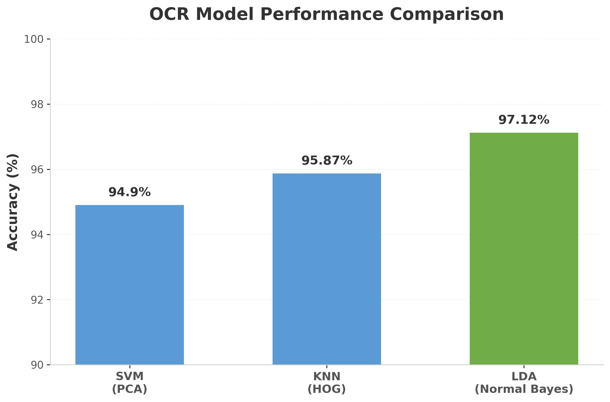
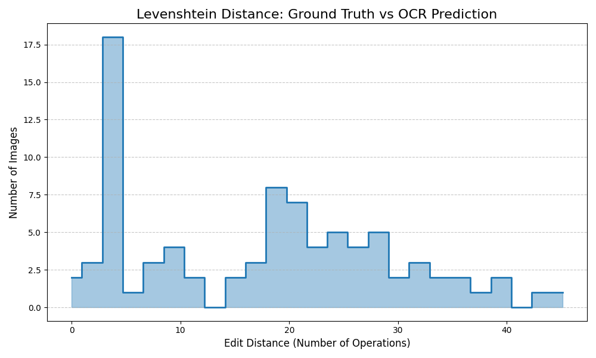

# Highway Traffic Sign Detection & OCR | Classical Computer Vision


> **Note:** This repository is **Phase 2** of an End-to-End Traffic Sign Recognition system. If you are looking for the pure Panel Detection architecture (Phase 1), please check out my [Traffic-Sign-Detection-CV repository](https://github.com/perezllanosnicolas/Traffic-Sign-Detection-CV).

## Overview
This repository contains a robust Machine Learning and Computer Vision pipeline designed to extract and read text from highway information panels. Built entirely from scratch without relying on modern Deep Learning APIs (like Tesseract or YOLO), this project demonstrates a deep understanding of Classical ML algorithms, feature extraction, and geometric topology.

## Core Architecture
The system operates in a sequential pipeline to handle perspective distortions and varying lighting conditions typical in driving scenarios:

1. **Adaptive Binarization:** Applies local Gaussian adaptive thresholding to isolate characters regardless of uneven sun glare or hard shadows.
2. **RANSAC Line Grouping:** Extracts individual character contours and groups them into logical horizontal lines using RANSAC linear regression (tolerating up to 8 degrees of perspective tilt).
3. **Feature Extraction & Classification:** Computes HOG (Histogram of Oriented Gradients) and PCA descriptors for each character, classifying them using a trained ML model.

## Performance & ML Benchmarking

We benchmarked three classical Machine Learning models to find the optimal classifier for character recognition. The **LDA + Normal Bayes** model achieved the highest accuracy on our validation set.

<p align="center">
  
</p>

### End-to-End Pipeline Evaluation
When integrating the OCR module with our MSER panel detector on raw highway images, the system successfully evaluated **85 valid text matches**. The performance was measured using the **Levenshtein (Edit) Distance** against a Ground Truth dataset.

<p align="center">
  
</p>

> **Deep Dive:** Want to understand the math behind our models, why the Levenshtein histogram has a "long tail", or why we chose RANSAC? Read our detailed [Technical Evaluation Report](docs/technical_report.md).

## Installation & Usage

**1. Clone the repository and install dependencies:**
```bash
git clone [https://github.com/tu-usuario/Traffic-Sign-OCR-System.git](https://github.com/tu-usuario/Traffic-Sign-OCR-System.git)
cd Traffic-Sign-OCR-System
pip install -r requirements.txt
```
**2. Evaluate OCR Machine Learning Models:**
```bash
python -m scripts.evaluate_ocr_models --classifier knn --train_path data/train_ocr --val_path data/test_ocr
```
**3. Run the Full OCR Pipeline (with live visualization):
```bash
python -m scripts.evaluate_ocr_models --classifier knn --train_path data/train_ocr --val_path data/test_ocr
```

## Authors 
This project was co-developed as part of a joint Computer Engineering research initiative by:
- Nicolás Pérez  - [www.linkedin.com/in/nicolasperezllanos]     | [https://github.com/perezllanosnicolas]
- Rubén Pisonero - [www.linkedin.com/in/ruben-pisonero]        | [https://github.com/rpisoner]