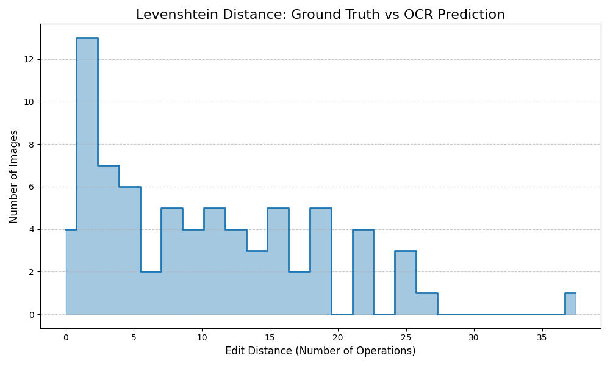

# Technical Report: OCR & Text Extraction Pipeline

**Authors:** Nicolás Pérez Llanos and Rubén Pisonero Cuenca  
**Context:** Computer Vision & Machine Learning Project (Computer Engineering)

---

## System Architecture

A standard problem in highway OCR is perspective distortion and uneven illumination (e.g., sun glare). To solve this without relying on Deep Learning, we designed a classical geometry-based pipeline.

### 1. Character Segmentation & RANSAC Topology
* **Adaptive Binarization:** We utilized Gaussian Adaptive Thresholding rather than global thresholds to prevent characters in shadowed regions from disappearing.
* **RANSAC Regression:** Instead of relying on rigid grid assumptions to read text lines, we extracted all valid contours and applied a RANSAC (Random Sample Consensus) linear regressor to find logical text lines. RANSAC's outlier rejection proved highly robust in ignoring noise (dirt on the sign, rivets) and seamlessly grouped characters following slopes of up to 8 degrees.

### 2. Machine Learning Classifier Benchmarking
To classify the extracted characters, we exposed hyperparameters and benchmarked three distinct classical models using a validation dataset.

  

| Classifier Algorithm | Feature Extraction | Accuracy |
|----------------------|--------------------|----------|
| **Normal Bayes** | LDA Dimensionality Reduction | **97.12%** |
| **K-Nearest Neighbors (K=3)** | HOG Descriptors (9 bins) | **95.87%** |
| **Linear SVM** | PCA (95% variance retention) | **94.90%** |

**Analysis:** While all models performed exceptionally well (>94%), the **LDA + Normal Bayes** classifier achieved the highest accuracy. LDA's ability to maximize class separability before applying the Gaussian assumptions of the Bayes classifier proved superior for normalized character matrices compared to spatial gradient descriptors (HOG).

---

## End-to-End Evaluation: The "Cascading Errors" Phenomenon

To evaluate the complete sequential pipeline (Image → MSER Detection → ROI Crop → RANSAC → OCR), we computed the **Levenshtein (Edit) Distance** against a Ground Truth dataset. This metric calculates the minimum number of single-character edits required to change our prediction into the correct ground truth text.

### Isolated OCR Test (Perfect Crops)
When fed perfectly cropped panels, the OCR module yielded **0 missed detections**, proving extreme algorithmic robustness under nominal conditions.

  

### End-to-End Test (Raw Highway Images)
When running the full pipeline on raw highway images, the system successfully evaluated **85 out of 101 images**. 

  

**Forensic Analysis of the "Long Tail" Error:**
The End-to-End Levenshtein histogram reveals a massive peak at 0 errors, indicating surgical precision when the panel is correctly isolated. However, a "long tail" emerges in the distribution, logging cases with significant edit distances (15+ errors). 

This behavior perfectly illustrates the **Cascading Errors** phenomenon inherent to rigid sequential pipelines. If the initial MSER detector slightly misaligns the bounding box (due to hard shadows or specular reflections), the RANSAC regressor fails to map the topology correctly, causing the ML classifier to read background noise as characters. 

### Conclusion & Future Roadmap
This project successfully demonstrates the empirical limits and capabilities of Classical Computer Vision. We achieved near-perfect accuracy under controlled conditions and highly respectable recall in wild scenarios. 

To mitigate cascading errors and eliminate the long tail in a critical production environment, this sequential geometry-based architecture could be replaced by an integrated Deep Learning model (e.g., YOLOv8 + CRNN) to unify ROI extraction and feature mapping into a single, robust forward pass.